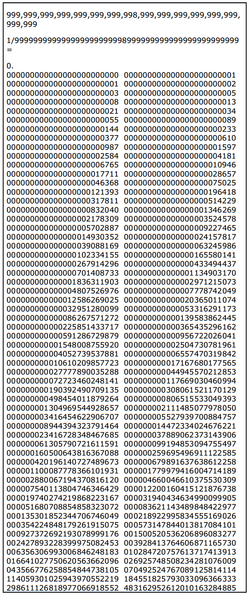

# 11

Die Potenzen von 11, übereinander geschrieben, erzeugen das pascalsche Dreieck:

```
11⁰ =                1
11¹ =               11
11² =              121
11³ =             1331
11⁴ =            14641
11⁵ =           151051
11⁶ =          1610511
...
```

## Fibonacci im pascalschen Dreieck

Die Fibonacci-Zahlen verstecken sich in den Quersummen der Zeilen des pascalschen Dreiecks. 

## Die 89-Verbindung

Addiert man die Fibonacci-Zahlen versetzt untereinander und bildet die Summe, ergibt sich die Zahl **11235951**. Der Kehrwert dieser Zahl nähert sich **89**:

```
1
 1
  2
   3
    5
     8
     13
      21
-----------
11235951

  1 / 11235951 ≈ 0,000000089000...
```

89 ist selbst eine Fibonacci-Zahl (die 11. Fibonaccizahl).

## Spiegelbild und Dezimalstellen

Setzt man 89 zwischen jeweils zwischen zwei Neunen (also **...9 89 9...**), erscheinen die Fibonacci-Zahlen elegant als Nachkommastellen:

https://www.mathsisfun.com/calculator-precision.html

